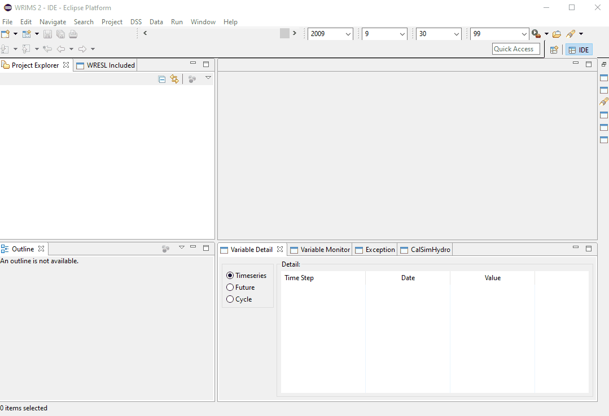

# Hello CalSim

This page contains instructions to download and run a standard CalSim 3 model.

## Step 1: Download Files
The Water Resource Integrated Modeling System (WRIMS) is a generalized water resources modeling system for 
evaluating operational alternatives of large, complex river basins. CalSim 3 is an application of WRIMS. The
WRIMS GUI/IDE is the entry point for modifying, running and debugging CalSim 3 models.
[Download the WRIMS GUI/IDE here](https://water.ca.gov/Library/Modeling-and-Analysis/Modeling-Platforms/Water-Resource-Integrated-Modeling-System)  

An example CalSim 3 model package is provided here. This package contains all the necessary inputs and code needed to run the model.
[Download an example CalSim 3 model package here]()

## Step 2: Open the WRIMS GUI/IDE and Load CalSim 3 Study

## Step 3: Open ".launch" file and Run CalSim 3 Study
