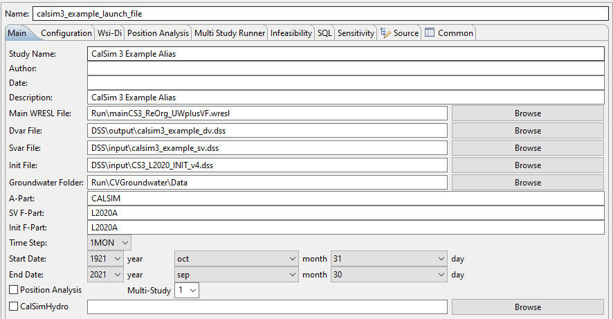

# Model Setup

## WRIMS
[WRIMS](https://water.ca.gov/Library/Modeling-and-Analysis/Modeling-Platforms/Water-Resource-Integrated-Modeling-System) is a generalized water resources modeling system for evaluating operational alternatives of large, complex river basins. WRIMS integrates a simulation language for flexible operational criteria specification, a linear programming solver for efficient water allocation decisions, and graphics capabilities for ease of use. These combined capabilities provide a comprehensive and powerful modeling tool for water resource systems simulation. The WRIMS GUI/IDE is the entry point for modifying, running and debugging CalSim 3 models.

## Launch File
The .launch file is the main configuration file for launching a CalSim 3 run. It designates the location of the main file, 
the [input (SV)]() .dss file and location to store the [output (DV)]() files. It should be located in the top-level directory of the 
CalSim 3 model package.  

To edit the .launch file *Right-Click on the .launch file → Run As → Run Configurations*

|Field|Description|
|--|--|
|[Main WRESL File](## Main WRESL file) | The top-level file within the CalSim 3 logic hierarchy.  |
|[Dvar File](## Decision Variable (DV) Output Files) | The CalSim 3 "Decision Variable" output file location. This file is conventionally placed in .../dss/output.|
|[Svar File](## State Variable (SV) Input Files) | The CalSim 3 "State Variable" input file location. This file will typically be located in .../dss/input.|
|[Init File](## Initial File) | the CalSim 3 initial file location. This file will typically be located in .../dss/input.|

!!! Note
    If a launch file does not already exist, then you will need to create one. [Click here for instructions](img/newlaunchfile.gif)
        
## Initial File

## State Variable (SV) Input Files

## Decision Variable (DV) Output Files

## Main WRESL file